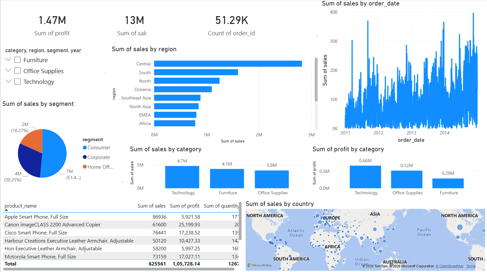

# Power BI Superstore Sales Dashboard

## Overview
This project presents an interactive Power BI dashboard analyzing Global Superstore sales data.

## Key Insights
- Total Sales: 13M
- Total Profit: 1.47M
- Orders: 51K

## Features
- Sales by Region
- Sales Trend Over Time
- Sales by Category
- Profit by Category
- Segment Distribution
- Global Sales Map

## Tools Used
- Power BI
- Data Visualization
- Data Analysis

## Dashboard Preview

